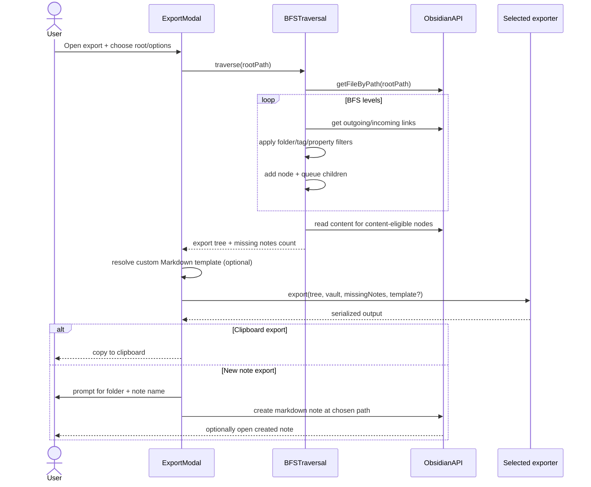
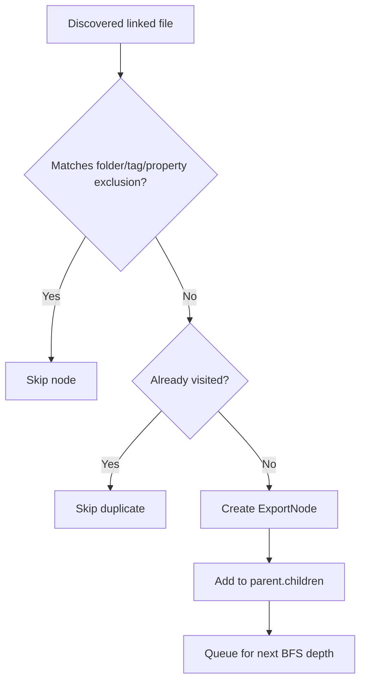
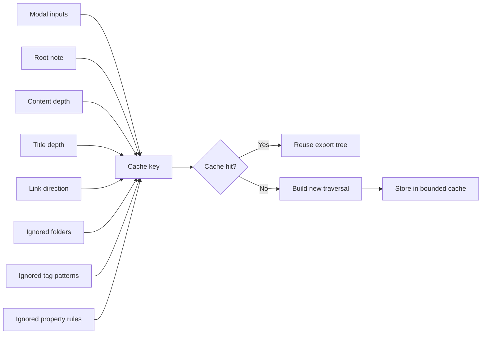

# Export Architecture

Updated: March 12, 2026

## Overview

Smart Export builds a note tree from a selected root note, applies traversal filters, serializes the result into a chosen export format, and then delivers that output either to the clipboard or to a newly created vault note based on the user's delivery settings.

Core modules:

- `src/ui/ExportModal.ts`
- `src/engine/BFSTraversal.ts`
- `src/engine/XMLExporter.ts`
- `src/engine/LlmMarkdownExporter.ts`
- `src/engine/PrintFriendlyMarkdownExporter.ts`
- `src/utils/folderFilters.ts`
- `src/utils/noteFilters.ts`
- `src/utils/llmMarkdownTemplateResolver.ts`

## 1) Export Runtime Flow

Markdown template selection and resolution:

1. User chooses output in the modal dropdown (`Output`).
2. The built-in template exposed in UI is `default` (`LLM-ready`).
3. Custom templates are loaded from `<llmMarkdownTemplateDirectory>/*.md`.
4. If a selected custom template is missing/unreadable, exporter falls back to built-in `default`.
5. Quick export passes `settings.defaultLlmTemplateId` to `resolveLlmMarkdownTemplate(...)`.
6. For an explicit template id, resolver attempts:
   - built-in template id match
   - `user:` template path read
   - built-in `default` fallback when selection is missing/unreadable
7. Folder fallback is only used when resolver is called without an explicit template id:
   - `<llmMarkdownTemplateDirectory>/llm-markdown.md`
   - first readable `.md` in `<llmMarkdownTemplateDirectory>/`
   - built-in `default`

Markdown link rewriting in exported note content:

1. Markdown-based exports (`llm-markdown`, `print-friendly-markdown`) render each exported note as a distinct heading within the generated note.
2. Wikilinks pointing to exported notes are rewritten into Obsidian same-note heading links (`[[#Heading]]`) that the exported note can navigate directly.
3. Aliased wikilinks append `ref:<target>` so the target remains readable in Obsidian/PDF contexts.
4. Image embeds (`![[...]]`) and code spans/fences are preserved without rewriting.

Print-friendly Markdown formatting:

1. The exporter can prepend a linked table of contents.
2. Heading numbering is assigned by the first depth-first path that includes each note:
   - root note: `1.`
   - first child: `1.1`
   - first grandchild: `1.1.1`
3. Cyclic or repeated notes keep the number from their first rendered position and are not emitted again.
4. Divider lines between note sections are controlled by print-friendly settings.

Notes:

- `{{metadata_yaml}}` renders as a complete YAML frontmatter block (including `---` delimiters).
- Templates can use full metadata keys (`{{total_notes_exported}}`) or aliases (`{{total_notes}}`).
- Plugin settings expose `Default output`, which shows XML/print-friendly, built-in `LLM-ready`, and custom templates.
- The modal output dropdown uses the same built-in filtering as settings (`LLM-ready` only).
- `compact` remains in the repository as a reference template example for users to copy/customize.

## 2) Traversal and Exclusion Logic

Notes:

- Exclusion applies in all link modes: `outgoing`, `incoming`, `both`.
- Excluded notes are not added to the tree and are not traversed further.
- The selected root note is always kept.

## 3) Tree Cache and Invalidation

Cache keys serialize ignored folders/tags/property rules with `JSON.stringify(...)` to avoid delimiter collisions.
