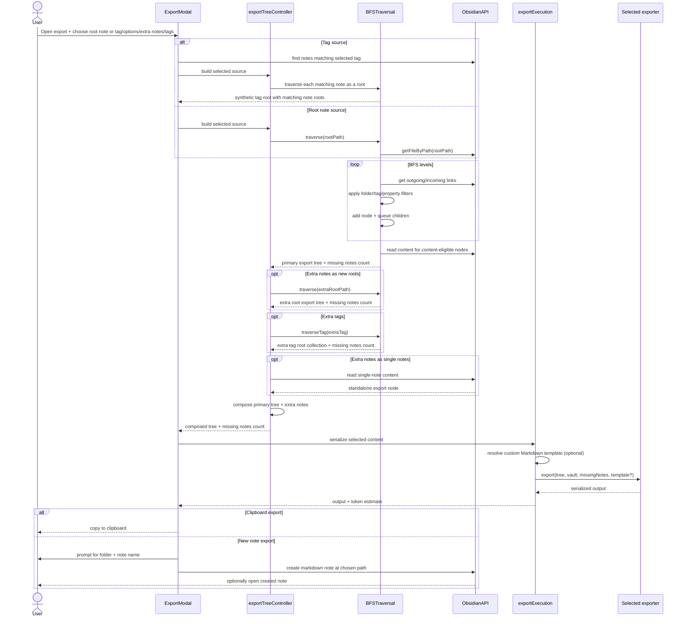
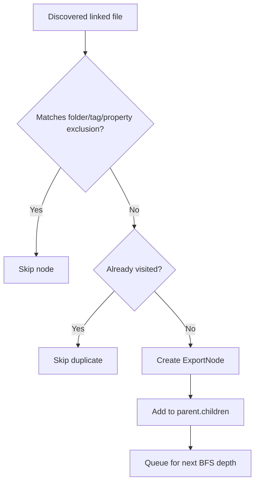
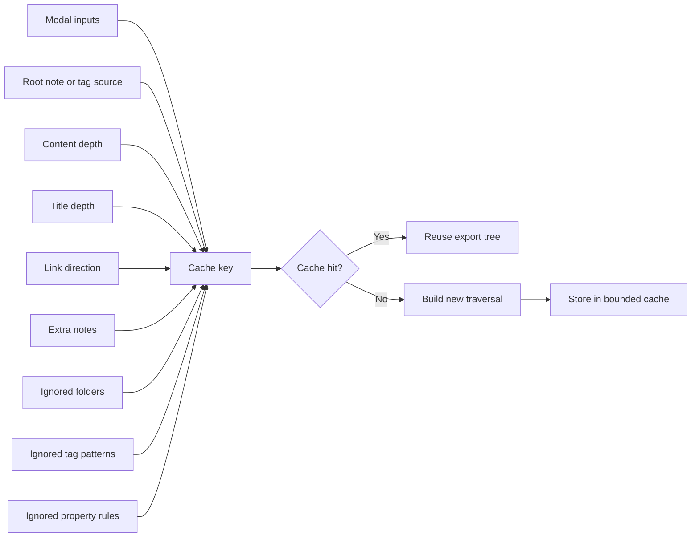

# Export Architecture

Updated: August 1, 2026

## Overview

Smart Export builds a note tree from a selected root note or tag source, applies traversal filters, serializes the result into a chosen export format, and then delivers that output either to the clipboard or to a newly created vault note based on the user's delivery settings.

Core modules:

- `src/ui/ExportModal.ts`
- `src/ui/exportModalState.ts`
- `src/ui/exportTreeController.ts`
- `src/ui/exportExecution.ts`
- `src/tagDiscovery.ts`
- `src/engine/BFSTraversal.ts`
- `src/engine/exportTreeComposition.ts`
- `src/engine/XMLExporter.ts`
- `src/engine/MermaidExporter.ts`
- `src/engine/LlmMarkdownExporter.ts`
- `src/engine/PrintFriendlyMarkdownExporter.ts`
- `src/utils/folderFilters.ts`
- `src/utils/noteFilters.ts`
- `src/utils/llmMarkdownTemplateResolver.ts`

## Module boundaries

The export UI is split into four layers with one-way dependencies:

- `ExportModal` is the Obsidian view. It creates controls, binds user events, and renders the current tree state.
- `exportModalState` contains DOM-free value types and reusable state rules for sources, export choices, tree selection/collapse, cache keys, content projections, and estimates.
- `exportTreeController` performs traversal and combines the primary source, extra roots, tags, and standalone notes. It receives an `isCurrent` guard so stale asynchronous builds never commit modal state.
- `exportExecution` applies content selection, resolves the selected template, and serializes output. Delivery-specific UI (notices, destination modal, and optional modal close) remains in `ExportModal`.

The plugin entrypoint does not implement these rules. `src/main.ts` only loads state, registers lifecycle-safe entrypoints, and delegates quick export and update-note work.

## 1) Export Runtime Flow

Markdown template selection and resolution:

1. User chooses output in the modal dropdown (`Output`).
2. The built-in template exposed in UI is `default` (`LLM-ready`).
3. Custom templates are loaded from `<llmMarkdownTemplateDirectory>/*.md`.
4. If a selected custom template is missing/unreadable, exporter falls back to built-in `default`.
5. Quick export passes `settings.defaultLlmTemplateId` to `resolveLlmMarkdownTemplate(...)`.
6. For an explicit template id, resolver attempts:
   - built-in template id match
   - `user:` template path read
   - built-in `default` fallback when selection is missing/unreadable
7. Folder fallback is only used when resolver is called without an explicit template id:
   - `<llmMarkdownTemplateDirectory>/llm-markdown.md`
   - first readable `.md` in `<llmMarkdownTemplateDirectory>/`
   - built-in `default`
8. Custom template paths are normalized and resolved through the public Vault API:
   - `Vault.getFileByPath()` and `Vault.cachedRead()` for template content
   - `Vault.getFolderByPath()` and immediate `TFolder.children` for template discovery
   - files hidden from Obsidian's vault index are intentionally not treated as templates

Content redaction:

1. Delimiter redaction and regular expression redaction are independently opt-in through settings.
2. `buildExportOutput(...)` applies redaction to a cloned export tree before invoking the selected exporter.
3. Redaction only changes included note content in the exported output; it does not mutate the cached traversal tree or source notes.
4. The configured delimiter marks both start and end of a private section. With the default delimiter, `:::private:::` renders as `REDACTED`.
5. Regular expression redaction rules are newline-separated and their matches are replaced with the configured regular expression replacement text.

Extra notes and tags:

1. Extra notes and tags are modal-session only and are not persisted in settings.
2. `Single note` entries include only that note's content and do not start traversal from that note.
3. `New root` entries run normal traversal from that note with the same depth, link direction, and exclusion settings as the selected root.
4. `Tag` entries run tag-source traversal and add matching notes as another export-only root collection.
5. When extra notes or tags exist, `exportTreeComposition` creates an export-only synthetic bundle root so exporters can keep receiving a single `ExportNode`.
6. Exporters skip synthetic grouping nodes when counting/rendering real vault notes.
7. Duplicate note IDs are deduplicated so explicitly added extra notes take precedence over the same note's descendant occurrence under the primary root: `exportTreeComposition` removes explicitly added note IDs from primary-tree descendants before appending the added note as a top-level child.

Tag sources:

1. The export modal can use either a root note or a tag source.
2. `TagDiscoveryService` builds the available tag list on demand from public Obsidian metadata APIs and shares the cached result across both tag pickers.
3. Metadata and vault events invalidate that cache; no tag scan runs during plugin startup or while an unchanged vault reopens a picker.
4. Tag source exports use normalized tags selected from inline metadata and frontmatter `tag`/`tags`.
5. Matching notes are sorted by vault path and represented as top-level roots under an export-only synthetic `Tag: #...` grouping node.
6. Folder, tag, and property exclusions apply to matching tag roots and to their traversed descendants.
7. Link direction, content depth, title depth, extra roots, extra tags, and single-note additions continue to apply normally.

Markdown link rewriting in exported note content:

1. Markdown-based exports (`llm-markdown`, `print-friendly-markdown`) render each exported note as a distinct heading within the generated note.
2. Wikilinks pointing to exported notes are rewritten into same-note links inside the generated note.
3. Note-level links target exported note headings (`[[#Heading]]`), while heading-specific links can target generated same-note block anchors (`[[#^block-id]]`) so the export lands on the referenced section.
4. Aliased wikilinks append `ref:<target>` so the target remains readable in Obsidian/PDF contexts.
5. Image embeds (`![[...]]`), inline code spans, and fenced code blocks are preserved without rewriting.

Print-friendly Markdown formatting:

1. The exporter can prepend a linked table of contents.
2. Heading numbering is assigned by the first depth-first path that includes each note:
   - root note: `1.`
   - first child: `1.1`
   - first grandchild: `1.1.1`
3. Cyclic or repeated notes keep the number from their first rendered position and are not emitted again.
4. Included note content headings are normalized under the exported note title heading when `Normalize content headings` is enabled. For example, if a note title renders as `### Note title`, a source `# Inner heading` renders as `#### Inner heading`. The setting is enabled by default and can be disabled to preserve source heading levels exactly.
5. Divider lines between note sections are controlled by print-friendly settings.
6. Optional HTML page breaks can replace divider lines between note sections; if a table of contents is included, this also moves the first note section onto a new page.

Mermaid diagram formatting:

1. Mermaid exports render the selected notes as a `flowchart TD` inside a fenced `mermaid` block so the result can be pasted into an Obsidian note and rendered immediately.
2. Note IDs are generated from stable vault paths; note titles remain the visible labels and are escaped for Mermaid syntax.
3. Directed edges come from traversal-discovered links, so cross-links and incoming/backlink direction are preserved even when the tree keeps only the first path to a note.
4. Nodes at the same traversal depth share a Mermaid class and color. Edges whose target is outside the selected export are omitted.

Notes:

- `{{metadata_yaml}}` renders as a complete YAML frontmatter block (including `---` delimiters).
- Templates can use full metadata keys (`{{total_notes_exported}}`) or aliases (`{{total_notes}}`).
- Plugin settings expose `Default output`, which shows XML, Mermaid, print-friendly, built-in `LLM-ready`, and custom templates.
- The modal output dropdown uses the same built-in filtering as settings (`LLM-ready` only) and includes Mermaid as a graph format.
- `compact` remains in the repository as a reference template example for users to copy/customize.

## 2) Traversal and Exclusion Logic

Notes:

- Exclusion applies in all link modes: `outgoing`, `incoming`, `both`.
- Excluded notes are not added to the tree and are not traversed further.
- The selected root note is always kept.

## 3) Tree Cache and Invalidation

Cache keys serialize extra notes and ignored folders/tags/property rules with `JSON.stringify(...)` to avoid delimiter collisions.
