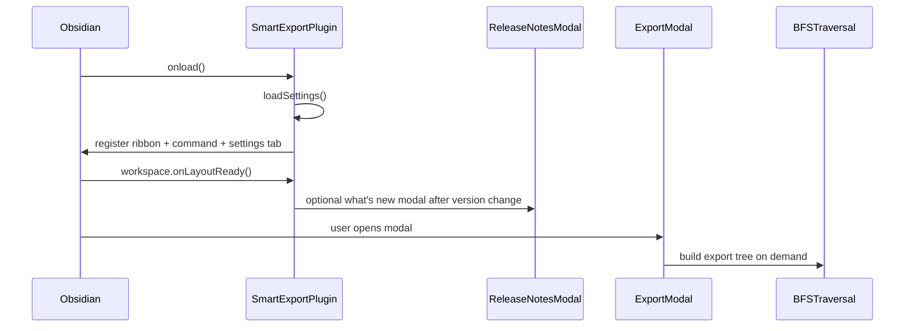

# Smart Export Startup Process

Updated: April 21, 2026

## Table of Contents

- [Overview](#overview)
- [Startup Phases](#startup-phases)
  - [Phase 1: Plugin registration](#phase-1-plugin-registration)
  - [Phase 2: User opens export modal](#phase-2-user-opens-export-modal)
  - [Phase 3: Tree build and export](#phase-3-tree-build-and-export)
- [Critical Runtime Mechanisms](#critical-runtime-mechanisms)
  - [Traversal cache keys](#traversal-cache-keys)
  - [Ignored note filtering](#ignored-note-filtering)
  - [Debounced settings writes](#debounced-settings-writes)
- [Shutdown Process](#shutdown-process)

## Overview

Smart Export startup is intentionally lightweight. The plugin registers commands and UI entrypoints on load, defers update-notice UI until the workspace layout is ready, and performs traversal/export work only when the user opens the export modal.

## Startup Phases

### Phase 1: Plugin registration

Trigger: `Plugin.onload()` in `src/main.ts`.

1. Load and normalize persisted settings.
2. Register ribbon icon (`Smart export`).
3. Register command (`Smart Export: Open export`).
4. Register settings tab UI.
5. After `workspace.onLayoutReady(...)`, compare the persisted plugin version with `manifest.json` and optionally open the what's new modal once per version.

No traversal is executed during plugin startup. The only deferred post-start action is the lightweight release-notes/version check.

### Phase 2: User opens export modal

Trigger: ribbon click or command invocation.

1. `ExportModal` is instantiated with current settings.
2. Modal initializes default values (depths, direction, format).
3. Optional auto-selection of active file is applied.

### Phase 3: Tree build and export

Trigger: tree preview render or export action.

1. Modal computes a traversal cache key from root/depth/mode/folder/tag/property filters.
2. On cache miss, `BFSTraversal.traverse(...)` builds the note tree.
3. Folder/tag/property exclusions are applied before nodes enter the tree.
4. Exporter serializes to XML, LLM Markdown, or Print-friendly Markdown.
5. Output is copied to clipboard.

## Critical Runtime Mechanisms

### Traversal cache keys

- Implemented in `ExportModal.getTreeCacheKey()`.
- Uses `JSON.stringify(...)` on ignored folders/tags/property rules to avoid delimiter collisions.

### Ignored note filtering

- Configured via:
  - `Ignored folders`
  - `Hide notes with tags`
  - `Hide notes with property rules`
- Accepts comma-separated entries.
- Applies to all link modes (`outgoing`, `incoming`, `both`).
- Excluded notes are not added or traversed further.
- Selected root note is always kept.

### Debounced settings writes

- Exclusion text input changes are debounced before `saveSettings()`.
- Prevents saving to disk on every keystroke.

## Shutdown Process

Trigger: `Plugin.onunload()` in `src/main.ts`.

Current behavior is minimal: no long-lived background workers are started by Smart Export, so unload remains lightweight.
